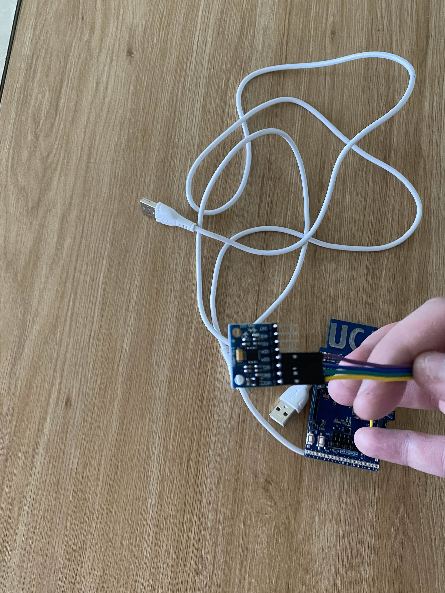

# Card_Cattle
This part of the project is about the code which is used by our Card for sending data to the gateways. 
## The hardware:
The hardware of this project is simply a UCA Board where you can find more information about on the repository : https://github.com/FabienFerrero/UCA21. Linked to this card, you can find an accelerometer MPU6050 (https://nshopvn.com/product/cam-bien-gia-toc-gy-521-6dof-imu-mpu6050/) which is used for the detection of the cow's movement.

If you want to link the sensor to the card, you just have to follow these connections:



## The code:
For the code, I recommend to use ArduinoIDE which is one of the best IDE for this kind of project. On ArduinoIDE, you can find different libraries which are useful for the project, I recommend you to install these libraries:
- Adafruit BusIO by Adafruit : v1.16.1
- Adafruit GFX Library by Adafruit : v1.11.10
- Adafruit MPU6050 by Adafruit : v2.2.6
- Adafruit SSD1306 by Adafruit : v2.5.11
- Adafruit Unified Sensor by Adafruit : v1.1.14
- IBM LMIC library by IBM : v1.5.1
- MCCI Arduino Development kit ADK by Terry Moore : v0.2.2
- MCCI Arduino LoRaWAN library by Terry Moore : v0.10.0
- MPU6050_tockn by tockn : v1.5.2

There is two files in this repository, here is a brief description of each of them:
### accelerometer_example.ino
This file is an example of how to use the accelerometer with the UCA Board. It is a simple code which allows you to see the values of the accelerometer on the serial monitor. You can use this code to test if the accelerometer is working correctly. This code is not used in the final project.
### lorawan_sender_packet.ino
This file is the code which is present on the card. It is the code which is used to send the data to the gateways. The data sent is the value of the accelerometer. 
There is some importants parts in this code:
```cpp
void do_send(osjob_t* j){
    sensors_event_t a, g, temp;
    mpu.getEvent(&a, &g, &temp);
    
    uint8_t payload[12];
    
    memcpy(payload, &a.acceleration.x, sizeof(float));
    memcpy(payload + 4, &a.acceleration.y, sizeof(float));
    memcpy(payload + 8, &a.acceleration.z, sizeof(float));
    
    // Send data
    if (LMIC.opmode & OP_TXRXPEND) {
        return;
    } else {
        LMIC_setTxData2(1, payload, sizeof(payload), 0);
        Serial.println(F("Packet queued"));
    }
}
```
This function will get the data send by the accelerometer and then it will send it to the gateway.
```cpp
static const u4_t DEVADDR = 0x01DF4759;
static const PROGMEM u1_t NWKSKEY[16] = {0x1C, 0xA5, 0x36, 0x0E, 0xE0, 0x6C, 0xAC, 0x7F, 0xF8, 0x4A, 0xB2, 0xC1, 0x8C, 0x11, 0x48, 0x60};
static const u1_t PROGMEM APPSKEY[16] = {0x44, 0x86, 0x93, 0x82, 0x2D, 0x2F, 0xF6, 0x53, 0x5C, 0xB2, 0x76, 0xDB, 0x9E, 0x83, 0x8D, 0x30};
```
These values are really important because they are the keys used to send the data to the gateway. You have to change these values with new ones if you create a new application on ChirpStack.
```cpp
LMIC_setupChannel(0, 921400000, DR_RANGE_MAP(DR_SF12, DR_SF7),  BAND_CENTI);     
LMIC_setupChannel(1, 921600000, DR_RANGE_MAP(DR_SF12, DR_SF7B), BAND_CENTI);
LMIC_setupChannel(2, 921800000, DR_RANGE_MAP(DR_SF12, DR_SF7),  BAND_CENTI);
LMIC_setupChannel(3, 922000000, DR_RANGE_MAP(DR_SF12, DR_SF7),  BAND_CENTI);
LMIC_setupChannel(4, 922200000, DR_RANGE_MAP(DR_SF12, DR_SF7),  BAND_CENTI);
LMIC_setupChannel(5, 922400000, DR_RANGE_MAP(DR_SF12, DR_SF7),  BAND_CENTI);
LMIC_setupChannel(6, 922600000, DR_RANGE_MAP(DR_SF12, DR_SF7),  BAND_CENTI);
LMIC_setupChannel(7, 922800000, DR_RANGE_MAP(DR_SF12, DR_SF7),  BAND_CENTI);
LMIC_setupChannel(8, 922700000, DR_RANGE_MAP(DR_FSK,  DR_FSK),  BAND_MILLI);
```
These lines are about the frequencies used to send the data. You can change these values if you want to use other frequencies for example if you want to use EU frequencies. (you can check this link: https://github.com/FabienFerrero/UCA21/blob/main/Code/LORAWAN/ABP/Basic/UCA-ABP_Basic/UCA-ABP_Basic.ino)
